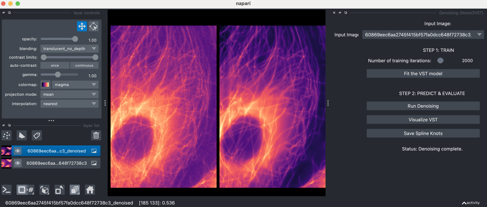

# Self-Calibrated Variance-Stabilizing Transformations for Real-World Image Denoising 
Sébastien Herbreteau and Michael Unser

## News

- 🔥 Accepted at ICCV'25 

- 🔥 The Napari plugin is out! 👉 Check it out [here](https://github.com/IbrahimaAlain/napari-noise2vst). Thanks to Ibrahima Alain Gueye (intern ENSAI)! 

## Napari plugin

Thanks to Ibrahima Alain Gueye (intern ENSAI) for developing the plugin for Napari. 👉 Check it out [here](https://github.com/IbrahimaAlain/napari-noise2vst).



## Requirements

Here is the list of libraries you need to install to execute the code:
* Python 3.12
* NumPy 1.26.4
* PyTorch 2.2
* Torchvision 0.17
* Matplotlib 3.9

To install in an environment using conda:

```
conda env create -f environment.yml
conda activate noise2vst
```
## Demo

We provide a Python Jupyter Notebook with example code to reproduce the experiments of the paper: [`demo.ipynb`](demo.ipynb).

## Pre-trained models

We use two popular off-the-shelf neural networks specialized in the removal of **Gaussian noise** (see folder [`models`](models/)):
* **FFDNet** [K. Zhang et al., IEEE Trans IP 2018]
* **DRUNet** [K. Zhang et al., IEEE Trans PAMI 2022]

Their pre-trained weights can be downloaded using the file [`download.py`](pretrained_weights/download.py).

## Noise2VST

Noise2VST is implemented in Pytorch in the file [`noise2vst.py`](models/noise2vst.py). Use the template below within your code:

```
# Instanciate the class
noise2VST = Noise2VST().to(device)

# Training (time depends on the performance of your CPU/GPU)
noise2VST.fit(img_noisy, m_ffdnet_color, nb_iterations=2000)

# Inference
with torch.no_grad():
    img_den = noise2VST(img_noisy, m_drunet_color)
```

## Caveat: Limitations

#### Noise assumptions

The noise assumptions underlying Noise2VST align with those commonly adopted in the literature. These assumptions are relatively broad and have been shown to be sufficient for a wide range of applications — in particular, fluorescence microscopy. Specifically, the noise is assumed to be **zero-mean** and **spatially independent**.

⚠️ The performance of Noise2VST is not guaranteed when the noise significantly deviates from these assumptions.

#### Multi-Frame Processing 

Noise2VST can process multiple noisy images simultaneously via a single VST; however, all input images must share the same noise distribution. 

⚠️ Mixing images with different noise characteristics in a single batch may lead to incorrect processing results.

## Acknowledgements

We acknowledge access to the facilities and expertise of the CIBM Center for Biomedical Imaging, a Swiss research center of excellence founded and supported by Lausanne University Hospital (CHUV), University of Lausanne (UNIL), École polytechnique fédérale de Lausanne (EPFL), University of Geneva (UNIGE), and Geneva University Hospitals (HUG).

This work was granted access to the HPC resources of IDRIS under the allocation 2024-AD011015932 made by GENCI.

## Citation
```BibTex
@article{herbreteau2024noise2vst,
  title={Self-Calibrated Variance-Stabilizing Transformations for Real-World Image Denoising},
  author={Herbreteau, S{\'e}bastien and Unser, Michael},
  journal={arXiv preprint arXiv:2407.17399},
  year={2024}
}
```
